Tutorial: Complete Example with Real Data
========================================

This tutorial demonstrates a complete workflow for using the transmission_models library with real epidemiological data. The example shows how to:

1. Set up a transmission model with epidemiological parameters
2. Load and process real data from CSV files
3. Create initial transmission networks using different methods
4. Run MCMC sampling without additional priors
5. Add location-based priors
6. Add genetic sequence priors
7. Visualize results with plots
8. Load and analyze saved models

Prerequisites
------------

Make sure you have the required dependencies installed:

.. code-block:: python

   from random import random
   import numpy as np
   import matplotlib.pyplot as plt
   import pandas as pd
   import networkx as nx
   from scipy.stats import nbinom, gamma, binom, expon
   from math import factorial
   import time
   import os, sys

   import transmission_models as tmod
   from transmission_models.utils import hierarchy_pos, hierarchy_pos_times, plot_transmision_network, tree_to_newick, search_firsts_sampled_siblings
   from transmission_models import didelot_unsampled as du
   import transmission_models.utils as utils
   from transmission_models.utils.topology_movements import *

Setting Up the Model
-------------------

First, we define the epidemiological parameters for our transmission model:

.. code-block:: python

   # Sampling parameters
   sampling_params = {
       "pi": 0.47,        # sampling probability
       "k_samp": 5.316,   # shape parameter for gamma distribution
       "theta_samp": 1.158 # scale parameter for gamma distribution
   }
   
   # Offspring parameters
   offspring_params = {
       "r": 4.47,         # rate of infection
       "p_inf": 0.62,     # probability of infection
   }
   
   # Infection parameters
   infection_params = {
       "k_inf": 5.70959959960973,     # shape parameter for gamma distribution
       "theta_inf": 1.061661377840768 # scale parameter for gamma distribution
   }
   
   # Create the model
   model = du(sampling_params, offspring_params, infection_params)

Loading Data
------------

Load the epidemiological data from a CSV file:

.. code-block:: python

   # Load data
   data_dir = "../data"
   df = pd.read_csv(data_dir + "/49_nodes_icpmr_delta_gisaid.csv")
   
   # Convert dates to datetime
   df['date_collection'] = pd.to_datetime(df['date_collection'])
   df['date_submitted'] = pd.to_datetime(df['date_submitted'])
   
   # Calculate sampling times relative to earliest collection
   df["date_sample"] = (df["date_collection"] - df['date_collection'].min()).dt.days
   
   # Estimate initial infection times using the infection model
   df["t_inf_ini"] = df.apply(
       lambda row: row.date_sample - gamma.rvs(
           infection_params["k_inf"], 
           loc=0, 
           scale=infection_params["theta_inf"], 
           size=1
       )[0], 
       axis=1
   )

Creating Host Objects
--------------------

Convert the dataframe into host objects:

.. code-block:: python

   # Generate a list of hosts from the dataframe
   data = []
   for i, h in enumerate(df.iloc):
       host = tmod.host(h.strain, i, t_sample=h.date_sample, t_inf=h.t_inf_ini)
       data.append(host)

Generating Initial Transmission Networks
---------------------------------------

You have to initialize a `nx.DiGraph` tree network in the model by using the `set_T` method. You can create your own network or use one of the utility functions to create a new one.

**Method 1: Infection-based network**

.. code-block:: python

   # Creating a network given a list of hosts
   T = tmod.utils.build_infection_based_network(model, data)
   model.set_T(T)

**Method 2: Infection-offspring-based network**

.. code-block:: python

   T = tmod.utils.build_infection_offspring_based_network(model, data)
   pos = tmod.utils.hierarchy_pos_times(T)
   tmod.utils.plot_transmision_network(T, pos=pos)

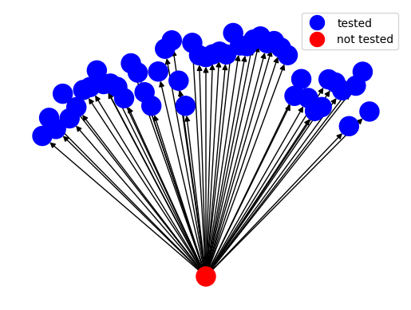

**Method 3: Infection-chain-based network**

.. code-block:: python

   T = tmod.utils.build_infection_chain_based_network(model, data)
   pos = tmod.utils.hierarchy_pos_times(T)
   tmod.utils.plot_transmision_network(T, pos=pos)

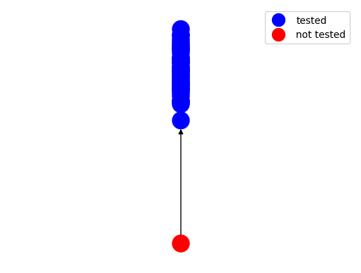

MCMC Sampling Without Additional Priors
---------------------------------------

Now you can run MCMC and start sampling networks:

.. code-block:: python

   # Set up MCMC sampling
   mcmc = tmod.MCMC(model)
   
   # MCMC parameters
   N_burn = 2000      # Number of initial iterations to discard (burn-in period)
   N_measure = 1000   # Interval between measurements for collecting samples
   N_iter = 20000     # Total number of iterations
   
   log_posteriors = []
   N_trees = []
   N_unsampleds = []
   
   for itt in range(N_iter):
       proposal, gg, pp, P, accepted, DL = mcmc.MCMC_iteration(verbose=False)
       if itt > N_burn and itt % N_measure == 0:
           log_posteriors.append(model.log_posterior_transmission_tree())
           N_unsampleds.append(len(model.unsampled_hosts))
           N_trees.append(len(search_firsts_sampled_siblings(model.root_host, model.T)))
           print(f"Iteration {itt}: log_posterior={log_posteriors[-1]:.3f}, "
                 f"unsampled_hosts={len(model.unsampled_hosts)}, "
                 f"trees={len(search_firsts_sampled_siblings(model.root_host, model.T))}")
   
   # Saving the model to later use it or visualize it
   model.save_json("model_simple.json")

Example output from the MCMC sampling:

.. code-block:: text

   Iteration 3000: log_posterior=628.478, unsampled_hosts=13, trees=3
   Iteration 4000: log_posterior=622.435, unsampled_hosts=12, trees=5
   Iteration 5000: log_posterior=620.815, unsampled_hosts=14, trees=6
   Iteration 6000: log_posterior=614.478, unsampled_hosts=16, trees=5
   Iteration 7000: log_posterior=641.400, unsampled_hosts=10, trees=3
   Iteration 8000: log_posterior=626.961, unsampled_hosts=14, trees=1
   Iteration 9000: log_posterior=595.251, unsampled_hosts=18, trees=1
   Iteration 10000: log_posterior=668.752, unsampled_hosts=5, trees=1
   Iteration 11000: log_posterior=667.538, unsampled_hosts=6, trees=2
   Iteration 12000: log_posterior=655.567, unsampled_hosts=11, trees=7
   Iteration 13000: log_posterior=623.757, unsampled_hosts=14, trees=6
   Iteration 14000: log_posterior=628.688, unsampled_hosts=13, trees=3
   Iteration 15000: log_posterior=655.833, unsampled_hosts=10, trees=2
   Iteration 16000: log_posterior=618.300, unsampled_hosts=17, trees=3
   Iteration 17000: log_posterior=623.577, unsampled_hosts=14, trees=5
   Iteration 18000: log_posterior=627.868, unsampled_hosts=16, trees=6
   Iteration 19000: log_posterior=610.084, unsampled_hosts=19, trees=8

Visualizing Results
------------------

Plot the distributions of key parameters from the MCMC sampling:

.. code-block:: python

   # Plot log posterior distribution
   plt.hist(log_posteriors)
   plt.xlabel("Log Posterior")
   plt.title("Log Posterior Distribution")
   plt.show()

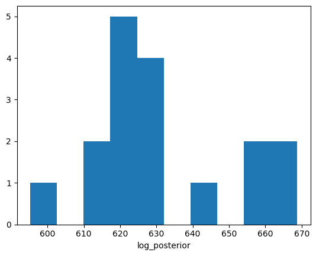

.. code-block:: python

   # Plot number of trees distribution
   plt.hist(N_trees)
   plt.xlabel("Number of Trees")
   plt.title("Number of Transmission Trees")
   plt.show()

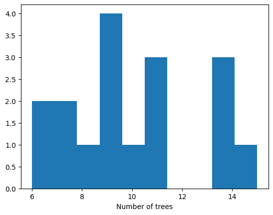

.. code-block:: python

   # Plot number of unsampled hosts distribution
   plt.hist(N_unsampleds)
   plt.xlabel("Number of Unsampled Hosts")
   plt.title("Number of Unsampled Hosts")
   plt.show()

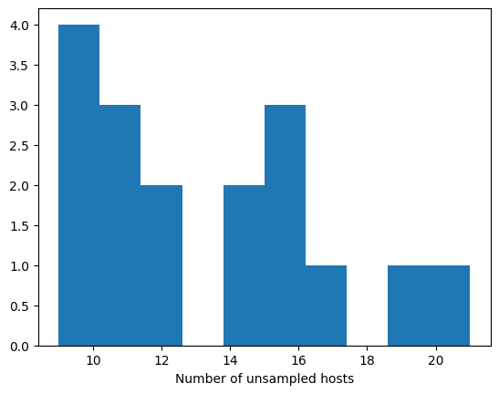

Visualizing the Transmission Network
-----------------------------------

Create a hierarchical visualization of the transmission network:

.. code-block:: python

   pos = hierarchy_pos_times(model.T, width=1., vert_gap=0.2, xcenter=0.5)
   tmod.utils.plot_transmision_network(model.T, pos=pos, highlighted_nodes=[model.root_host])

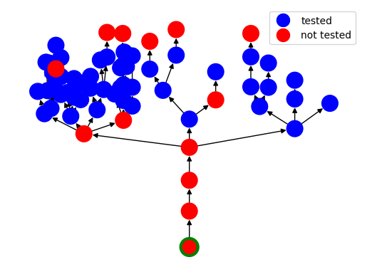

Adding Location Information
--------------------------

To incorporate location data, we need to create a distance matrix and add it to the model:

.. code-block:: python

   # Load location data
   dist_df = pd.read_csv("../data/location_49_hosts.tsv", sep="\t", index_col="strain_x")
   
   # Create distance matrix
   dist_loc = np.zeros((len(model.T), len(model.T)))
   i = 0
   for h in model.T:
       if not h.sampled:
           continue
       if str(h) not in dist_df.index:
           dist_loc[int(h), :] = None
           dist_loc[:, int(h)] = None
           continue
       for h2 in model.T[h]:
           if str(h2) not in dist_df.index:
               dist_loc[int(h2), :] = None
               dist_loc[:, int(h2)] = None
               continue
           if not h2.sampled:
               continue
           i += 1
           dist_loc[int(h), int(h2)] = dist_df.loc[str(h), str(h2)]
           dist_loc[int(h2), int(h)] = dist_df.loc[str(h2), str(h)]
   
   # Add location prior to the model
   model.add_same_location_prior(0.1, 15, dist_loc)
   model.same_location_log_prior = model.same_location_prior.log_prior_T(model.T)

MCMC with Location Information
-----------------------------

Run MCMC sampling with location priors:

.. code-block:: python

   mcmc = tmod.MCMC(model)
   
   N_burn = 2000
   N_measure = 100
   N_iter = 20000
   
   log_posteriors = []
   N_trees = []
   N_unsampleds = []
   
   for itt in range(N_iter):
       proposal, gg, pp, P, accepted, DL = mcmc.MCMC_iteration()
       if itt > N_burn and itt % N_measure == 0:
           log_posteriors.append(model.log_posterior_transmission_tree())
           N_unsampleds.append(len(model.unsampled_hosts))
           N_trees.append(len(search_firsts_sampled_siblings(model.root_host, model.T)))
           print(f"Iteration {itt}: log_posterior={log_posteriors[-1]:.3f}, "
                 f"unsampled_hosts={len(model.unsampled_hosts)}, "
                 f"trees={len(search_firsts_sampled_siblings(model.root_host, model.T))}")
   
   # Saving the model to later use it or visualize it
   model.save_json("model_location.json")

Example output from the MCMC sampling with location priors:

.. code-block:: text

   Iteration 2100: log_posterior=550.090, unsampled_hosts=16, trees=6
   Iteration 2200: log_posterior=552.332, unsampled_hosts=16, trees=6
   Iteration 2300: log_posterior=550.420, unsampled_hosts=15, trees=6
   Iteration 2400: log_posterior=551.907, unsampled_hosts=14, trees=7
   Iteration 2500: log_posterior=564.712, unsampled_hosts=13, trees=8
   Iteration 2600: log_posterior=572.233, unsampled_hosts=12, trees=6
   Iteration 2700: log_posterior=573.286, unsampled_hosts=12, trees=7
   Iteration 2800: log_posterior=577.580, unsampled_hosts=12, trees=7
   Iteration 2900: log_posterior=550.249, unsampled_hosts=17, trees=2
   Iteration 3000: log_posterior=566.957, unsampled_hosts=14, trees=2
   Iteration 3100: log_posterior=587.359, unsampled_hosts=8, trees=2
   Iteration 3200: log_posterior=580.098, unsampled_hosts=10, trees=2
   Iteration 3300: log_posterior=581.744, unsampled_hosts=12, trees=3
   Iteration 3400: log_posterior=566.052, unsampled_hosts=12, trees=3
   Iteration 3500: log_posterior=566.167, unsampled_hosts=11, trees=4
   Iteration 3600: log_posterior=532.199, unsampled_hosts=18, trees=2
   Iteration 3700: log_posterior=558.425, unsampled_hosts=12, trees=3
   Iteration 3800: log_posterior=552.115, unsampled_hosts=13, trees=3
   Iteration 3900: log_posterior=584.519, unsampled_hosts=7, trees=3
   Iteration 4000: log_posterior=557.722, unsampled_hosts=11, trees=4
   Iteration 4100: log_posterior=556.659, unsampled_hosts=13, trees=3
   Iteration 4200: log_posterior=558.776, unsampled_hosts=11, trees=2
   Iteration 4300: log_posterior=561.215, unsampled_hosts=11, trees=2
   Iteration 4400: log_posterior=572.141, unsampled_hosts=8, trees=2
   Iteration 4500: log_posterior=582.607, unsampled_hosts=7, trees=2
   Iteration 4600: log_posterior=579.311, unsampled_hosts=9, trees=2
   Iteration 4700: log_posterior=576.168, unsampled_hosts=11, trees=2
   Iteration 4800: log_posterior=585.201, unsampled_hosts=9, trees=2
   Iteration 4900: log_posterior=573.914, unsampled_hosts=11, trees=2

Visualizing Results with Location Priors
---------------------------------------

Plot the distributions from MCMC sampling with location information:

.. code-block:: python

   # Plot log posterior distribution with location priors
   plt.hist(log_posteriors)
   plt.xlabel("Log Posterior")
   plt.title("Log Posterior Distribution (with Location Priors)")
   plt.show()

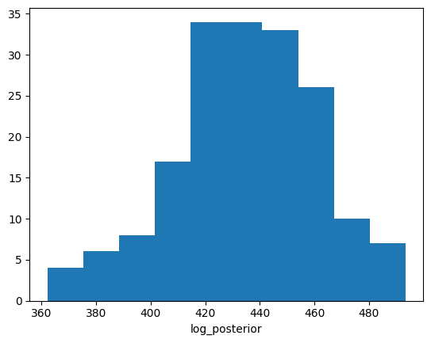

.. code-block:: python

   # Plot number of trees with location priors
   plt.hist(N_trees)
   plt.xlabel("Number of Trees")
   plt.title("Number of Transmission Trees (with Location Priors)")
   plt.show()

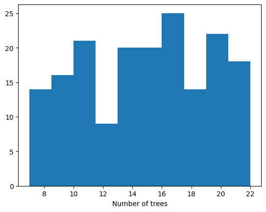

.. code-block:: python

   # Plot number of unsampled hosts with location priors
   plt.hist(N_unsampleds)
   plt.xlabel("Number of Unsampled Hosts")
   plt.title("Number of Unsampled Hosts (with Location Priors)")
   plt.show()

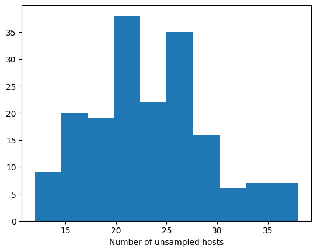

Visualizing Transmission Network with Location Information
--------------------------------------------------------

.. code-block:: python

   pos = hierarchy_pos_times(model.T, root=model.root_host, width=1., 
                           vert_gap=0.2, vert_loc=0, xcenter=0.5)
   tmod.utils.plot_transmision_network(model.T, pos=pos)

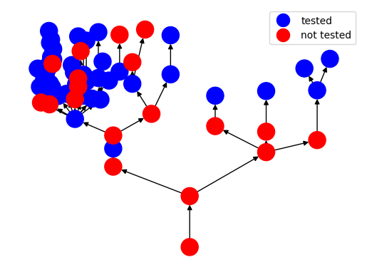

Adding Genetic Information
-------------------------

To incorporate genetic sequence data, we need to create a genetic distance matrix:

.. code-block:: python

   # Load genetic data
   data_dir = "../data/genetic_49_hosts.tsv"
   dist_df = pd.read_csv(data_dir, sep="\t", index_col=0)
   
   # Create genetic distance matrix
   dist_gen = np.zeros((len(model.T), len(model.T)))
   i = 0
   for h in model.T:
       if not h.sampled:
           continue
       for h2 in model.T[h]:
           if not h2.sampled:
               continue
           i += 1
           print(i, h, h2)
           dist_gen[int(h), int(h2)] = dist_df.loc[h.id, h2.id]
           dist_gen[int(h2), int(h)] = dist_df.loc[h2.id, h.id]
   
   # Add genetic prior to the model
   model.add_genetic_prior(0.1065, dist_gen)
   model.genetic_log_prior = model.genetic_prior.log_prior_T(model.T)

Example output from processing genetic data:

.. code-block:: text

    1 hCoV-19/Australia/NSW1679/2021 hCoV-19/Australia/NSW1680/2021
    2 hCoV-19/Australia/NSW1679/2021 hCoV-19/Australia/NSW1760/2021
    3 hCoV-19/Australia/NSW1732/2021 hCoV-19/Australia/NSW1761/2021
    4 hCoV-19/Australia/NSW1662/2021 hCoV-19/Australia/NSW1738/2021
    5 hCoV-19/Australia/NSW1649/2021 hCoV-19/Australia/NSW1668/2021
    6 hCoV-19/Australia/NSW1649/2021 hCoV-19/Australia/NSW1665/2021
    7 hCoV-19/Australia/NSW1667/2021 hCoV-19/Australia/NSW1713/2021
    8 hCoV-19/Australia/NSW1655/2021 hCoV-19/Australia/NSW1705/2021
    9 hCoV-19/Australia/NSW1655/2021 hCoV-19/Australia/NSW1672/2021
    10 hCoV-19/Australia/NSW1655/2021 hCoV-19/Australia/NSW1662/2021
    11 hCoV-19/Australia/NSW1765/2021 hCoV-19/Australia/NSW1781/2021
    12 hCoV-19/Australia/NSW1664/2021 hCoV-19/Australia/NSW1653/2021
    13 hCoV-19/Australia/NSW1664/2021 hCoV-19/Australia/NSW1654/2021
    14 hCoV-19/Australia/NSW1664/2021 hCoV-19/Australia/NSW1655/2021
    15 hCoV-19/Australia/NSW1664/2021 hCoV-19/Australia/NSW1677/2021
    16 hCoV-19/Australia/NSW1664/2021 hCoV-19/Australia/NSW1649/2021
    17 hCoV-19/Australia/NSW1664/2021 hCoV-19/Australia/NSW1658/2021
    18 hCoV-19/Australia/NSW1661/2021 hCoV-19/Australia/NSW1765/2021
    19 hCoV-19/Australia/NSW1668/2021 hCoV-19/Australia/NSW1782/2021
    20 hCoV-19/Australia/NSW1666/2021 hCoV-19/Australia/NSW1660/2021
    21 hCoV-19/Australia/NSW1672/2021 hCoV-19/Australia/NSW1768/2021
    22 hCoV-19/Australia/NSW1762/2021 hCoV-19/Australia/NSW1743/2021
    23 hCoV-19/Australia/NSW1694/2021 hCoV-19/Australia/NSW1748/2021
    24 hCoV-19/Australia/NSW1694/2021 hCoV-19/Australia/NSW1772/2021
    25 hCoV-19/Australia/NSW1773/2021 hCoV-19/Australia/NSW1793/2021
    26 hCoV-19/Australia/NSW1785/2021 hCoV-19/Australia/NSW1727/2021

MCMC with Genetic Information
----------------------------

Run MCMC sampling with genetic priors:

.. code-block:: python

   mcmc = tmod.MCMC(model)
   
   N_burn = 200
   N_measure = 10
   N_iter = 2000
   
   log_posteriors = []
   N_trees = []
   N_unsampleds = []
   
   for itt in range(N_iter):
       proposal, gg, pp, P, accepted, DL = mcmc.MCMC_iteration()
       if itt > N_burn and itt % N_measure == 0:
           log_posteriors.append(model.log_posterior_transmission_tree())
           N_unsampleds.append(len(model.unsampled_hosts))
           N_trees.append(len(search_firsts_sampled_siblings(model.root_host, model.T)))
           print(f"Iteration {itt}: log_posterior={log_posteriors[-1]:.3f}, "
                 f"unsampled_hosts={len(model.unsampled_hosts)}, "
                 f"trees={len(search_firsts_sampled_siblings(model.root_host, model.T))}")
   
   # Saving the model to later use it or visualize it
   model.save_json("model_genetic.json")

Example output from the MCMC sampling with genetic priors:

.. code-block:: text

   Iteration 210: log_posterior=477.323, unsampled_hosts=17, trees=4
   Iteration 220: log_posterior=479.299, unsampled_hosts=17, trees=4
   Iteration 230: log_posterior=478.741, unsampled_hosts=17, trees=4
   Iteration 240: log_posterior=480.454, unsampled_hosts=17, trees=4
   Iteration 250: log_posterior=476.393, unsampled_hosts=18, trees=4
   Iteration 260: log_posterior=481.108, unsampled_hosts=17, trees=4
   Iteration 270: log_posterior=485.188, unsampled_hosts=16, trees=4
   Iteration 280: log_posterior=484.058, unsampled_hosts=16, trees=4
   Iteration 290: log_posterior=484.391, unsampled_hosts=16, trees=4
   Iteration 300: log_posterior=482.524, unsampled_hosts=16, trees=4
   Iteration 310: log_posterior=485.898, unsampled_hosts=16, trees=4
   Iteration 320: log_posterior=485.950, unsampled_hosts=16, trees=4
   Iteration 330: log_posterior=478.521, unsampled_hosts=18, trees=4
   Iteration 340: log_posterior=481.231, unsampled_hosts=18, trees=4
   Iteration 350: log_posterior=486.563, unsampled_hosts=17, trees=4
   Iteration 360: log_posterior=490.663, unsampled_hosts=16, trees=4
   Iteration 370: log_posterior=490.254, unsampled_hosts=16, trees=4
   Iteration 380: log_posterior=492.284, unsampled_hosts=16, trees=4
   Iteration 390: log_posterior=493.078, unsampled_hosts=16, trees=4
   Iteration 400: log_posterior=486.902, unsampled_hosts=17, trees=4
   Iteration 410: log_posterior=479.086, unsampled_hosts=19, trees=4
   Iteration 420: log_posterior=482.639, unsampled_hosts=18, trees=4
   Iteration 430: log_posterior=482.158, unsampled_hosts=18, trees=4
   Iteration 440: log_posterior=479.389, unsampled_hosts=19, trees=4
   Iteration 450: log_posterior=474.540, unsampled_hosts=20, trees=4
   Iteration 460: log_posterior=474.672, unsampled_hosts=20, trees=4
   Iteration 470: log_posterior=468.767, unsampled_hosts=21, trees=4
   Iteration 480: log_posterior=466.031, unsampled_hosts=22, trees=4
   Iteration 490: log_posterior=465.184, unsampled_hosts=22, trees=4

Visualizing Results with Genetic Priors
-------------------------------------

Plot the distributions from MCMC sampling with genetic information:

.. code-block:: python

   # Plot log posterior distribution with genetic priors
   plt.hist(log_posteriors)
   plt.xlabel("Log Posterior")
   plt.title("Log Posterior Distribution (with Genetic Priors)")
   plt.show()

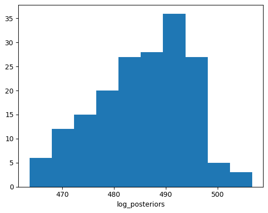

.. code-block:: python

   # Plot number of trees with genetic priors
   plt.hist(N_trees)
   plt.xlabel("Number of Trees")
   plt.title("Number of Transmission Trees (with Genetic Priors)")
   plt.show()

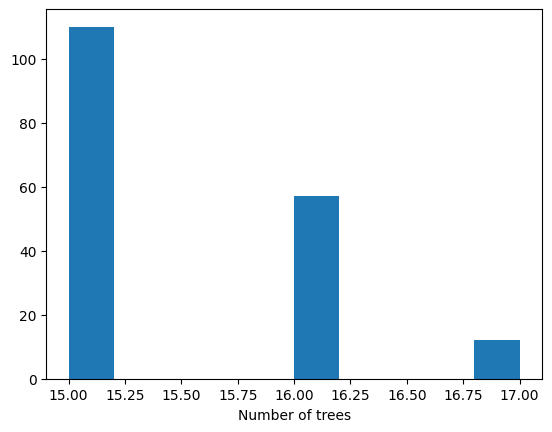

.. code-block:: python

   # Plot number of unsampled hosts with genetic priors
   plt.hist(N_unsampleds)
   plt.xlabel("Number of Unsampled Hosts")
   plt.title("Number of Unsampled Hosts (with Genetic Priors)")
   plt.show()

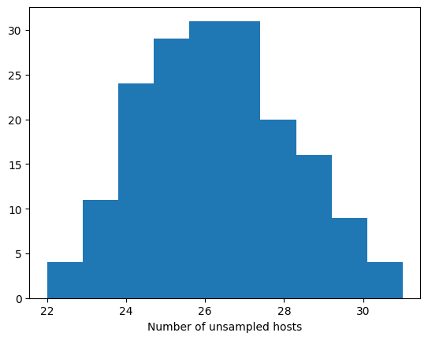

Final Transmission Network Visualization
---------------------------------------

Create the final transmission network visualization with all priors:

.. code-block:: python

   pos = hierarchy_pos_times(model.T, root=model.root_host, width=1., 
                           vert_gap=0.2, vert_loc=0, xcenter=0.5)
   tmod.utils.plot_transmision_network(model.T, pos=pos)

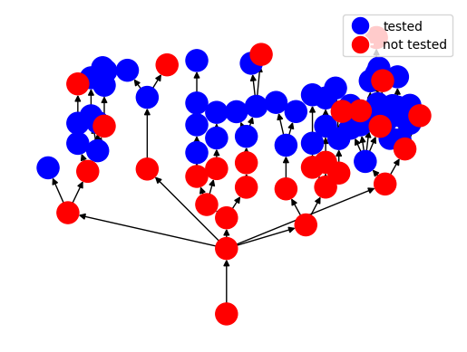

Loading and Analyzing Saved Models
---------------------------------

You can load JSON files to continue running the MCMC, analyze it, or visualize it. The models can also be visualized in the `tree layout <https://www.maths.usyd.edu.au/u/oscarf/tree_layout/>`_ webpage:

.. code-block:: python

   import transmission_models as tmod
   from transmission_models import didelot_unsampled as du
   from transmission_models.utils import hierarchy_pos_times

   # Loading the genetic model
   genetic_model = du.json_to_tree("model_genetic.json")

   pos = hierarchy_pos_times(genetic_model.T, root=genetic_model.root_host, width=1., 
                           vert_gap=0.2, vert_loc=0, xcenter=0.5)

   tmod.utils.plot_transmision_network(genetic_model.T, pos=pos)

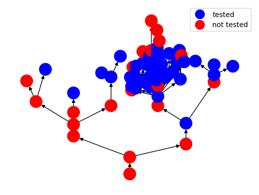

External Tree Layout Tool
------------------------

For advanced tree visualization, you can use the external tree layout tool available at `https://www.maths.usyd.edu.au/u/oscarf/tree_layout/`. This tool provides interactive visualizations of transmission networks.

Summary
-------

This tutorial demonstrates a complete workflow for transmission network inference with real data:

1. **Model Setup**: Define epidemiological parameters for sampling, offspring, and infection models
2. **Data Loading**: Load and process real epidemiological data from CSV files
3. **Network Initialization**: Create initial transmission networks using multiple methods
4. **Basic MCMC**: Run MCMC sampling without additional priors and visualize results
5. **Location Priors**: Add location-based transmission constraints and re-run MCMC
6. **Genetic Priors**: Add genetic sequence similarity constraints and final MCMC run
7. **Visualization**: Create hierarchical visualizations of the transmission network at each stage
8. **Model Persistence**: Save and load models for further analysis

The plots show how the posterior distributions change as we add more information:

- **Log Posterior**: Shows the model fit improvement with additional priors
- **Number of Trees**: Indicates the complexity of the transmission network
- **Number of Unsampled Hosts**: Shows how many intermediate hosts are inferred
- **Network Visualizations**: Display the hierarchical structure of transmission chains

The example demonstrates how the library can handle real-world epidemiological data and incorporate multiple types of information (temporal, spatial, and genetic) to improve transmission network inference.

For more detailed examples and advanced usage, see the :doc:`api` reference and the original `Example.ipynb <https://github.com/oscarcapote/transmission_models/blob/main/examples/Example.ipynb>`_ notebook. 