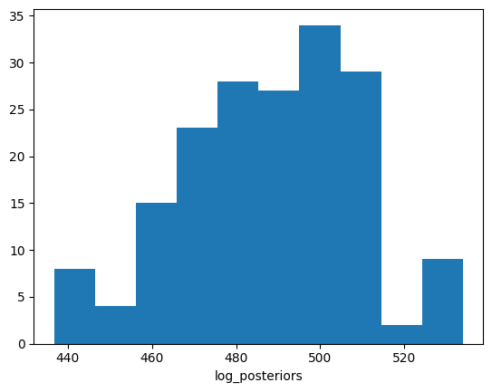

Tutorial: Transmission Model Example
===================================

This tutorial walks through a complete example using the `transmission_models` library, as shown in the Jupyter notebook `Example.ipynb`.

.. contents:: Table of Contents
   :depth: 2

1. Loading Parameters
---------------------

.. code-block:: python

   # Simple example of using the transmission_models library
   from random import random
   import numpy as np
   import matplotlib.pyplot as plt
   import pandas as pd
   import networkx as nx
   from scipy.stats import nbinom, gamma, binom, expon
   from math import factorial
   import time
   import os,sys

   import transmission_models as tmod
   from transmission_models.utils import hierarchy_pos, hierarchy_pos_times, plot_transmision_network, tree_to_newick, search_firsts_sampled_siblings
   from transmission_models import didelot_unsampled as du
   import transmission_models.utils as utils
   from transmission_models.utils.topology_movements import *

.. code-block:: python

   # 1. Loading parameters
   # First, initialize the parameters of the model and the model
   sampling_params = {
       "pi": 0.47,
       "k_samp": 5.316,
       "theta_samp": 1.158
   }
   offspring_params = {
       "r": 4.47,
       "p_inf": 0.62,
   }
   infection_params = {
       "k_inf": 5.70959959960973,
       "theta_inf": 1.061661377840768
   }
   # Creating the model
   model = du(sampling_params, offspring_params, infection_params)

2. Loading Data
---------------

.. code-block:: python

   # 2. Loading data
   # Second, load your datasets and generate a list of `host`.
   data_dir = "../data"
   df = pd.read_csv(data_dir+"/49_nodes_icpmr_delta_gisaid.csv")
   df['date_collection'] = pd.to_datetime(df['date_collection'])
   df['date_submitted'] = pd.to_datetime(df['date_submitted'])
   df["date_sample"] = (df["date_collection"]-df['date_collection'].min()).dt.days
   df["t_inf_ini"] = df.apply(lambda row: row.date_sample-gamma.rvs(infection_params["k_inf"], loc=0, scale=infection_params["theta_inf"], size=1)[0], axis=1)

   # Generate a list of hosts from the dataframe
   data = []
   for i, h in enumerate(df.iloc):
       host = tmod.host(h.strain, i, t_sample=h.date_sample, t_inf=h.t_inf_ini)
       data.append(host)

3. Generating Initial Condition Network
---------------------------------------

.. code-block:: python

   # 3. Generating initial condition network
   # You have to initialize a `nx.DiGraph` tree network in the model by using `set_T` method. You can create your own network or use one of the functions to create a new one.
   # Creating a network given a list of hosts
   T = tmod.utils.build_infection_based_network(model, data)
   model.set_T(T)

   ### Other functions to generate predefined networks layouts
   # There are three predefined tree networks layouts, all with an unsampled host as root host:
   T = tmod.utils.build_infection_offspring_based_network(model, data)
   pos = tmod.utils.hierarchy_pos_times(T)
   tmod.utils.plot_transmision_network(T, pos=pos)

   T = tmod.utils.build_infection_chain_based_network(model, data)
   pos = tmod.utils.hierarchy_pos_times(T)
   tmod.utils.plot_transmision_network(T, pos=pos)

4. MCMC with No Location and Genetic Information
------------------------------------------------

.. code-block:: python

   # MCMC with no location and genetic information
   # Now you can run a MCMC and start sampling networks
   # Set up MCMC sampling parameters
   # N_burn: Number of initial iterations to discard (burn-in period)
   # N_measure: Interval between measurements for collecting samples
   # N_iter: Total number of iterations
   N_burn = 2000
   N_measure = 1000
   N_iter = 20000

   log_posteriors = []
   N_trees = []
   N_unsampleds = []

   mcmc = tmod.MCMC(model)
   for itt in range(N_iter):
       proposal,gg,pp,P,accepted,DL = mcmc.MCMC_iteration(verbose=False)
       if itt>N_burn and itt%N_measure==0:
           log_posteriors.append(model.log_posterior_transmission_tree())
           N_unsampleds.append(len(model.unsampled_hosts))        
           N_trees.append(len(search_firsts_sampled_siblings(model.root_host,model.T)))
           print(f"Iteration {itt}: log_posterior={log_posteriors[-1]:.3f}, unsampled_hosts={len(model.unsampled_hosts)}, trees={len(search_firsts_sampled_siblings(model.root_host,model.T))}")

   # Saving the model to later use it or visualize it
   model.save_json("model_simple.json")

.. code-block:: text

   Iteration 3000: log_posterior=622.669, unsampled_hosts=23, trees=14
   Iteration 4000: log_posterior=635.073, unsampled_hosts=19, trees=16
   Iteration 5000: log_posterior=626.537, unsampled_hosts=20, trees=15
   Iteration 6000: log_posterior=624.841, unsampled_hosts=21, trees=17
   Iteration 7000: log_posterior=639.360, unsampled_hosts=16, trees=15
   Iteration 8000: log_posterior=620.888, unsampled_hosts=20, trees=20
   Iteration 9000: log_posterior=652.655, unsampled_hosts=16, trees=16
   Iteration 10000: log_posterior=649.227, unsampled_hosts=17, trees=17
   Iteration 11000: log_posterior=626.293, unsampled_hosts=23, trees=13
   Iteration 12000: log_posterior=651.395, unsampled_hosts=17, trees=10
   Iteration 13000: log_posterior=669.242, unsampled_hosts=13, trees=10
   Iteration 14000: log_posterior=672.982, unsampled_hosts=11, trees=8
   Iteration 15000: log_posterior=643.626, unsampled_hosts=18, trees=5
   Iteration 16000: log_posterior=672.199, unsampled_hosts=10, trees=7
   Iteration 17000: log_posterior=678.747, unsampled_hosts=13, trees=10
   Iteration 18000: log_posterior=665.205, unsampled_hosts=11, trees=8
   Iteration 19000: log_posterior=625.519, unsampled_hosts=23, trees=12

.. code-block:: python

   plt.hist(log_posteriors)
   plt.xlabel("log_posterior")
   plt.show()

.. code-block:: python

   plt.hist(N_trees)
   plt.xlabel("Number of trees")
   plt.show()

.. code-block:: python

   plt.hist(N_unsampleds)
   plt.xlabel("Number of unsampled hosts")
   plt.show()

.. code-block:: python

   pos = hierarchy_pos_times(model.T, width=1., vert_gap=0.2, xcenter=0.5)
   tmod.utils.plot_transmision_network(model.T, pos=pos, highlighted_nodes=[model.root_host])

5. MCMC with Location Information
---------------------------------

.. code-block:: python

   # MCMC with location information
   # To add location to the model you need a 2d array indexed with the id of the hosts and add it to the model with the `add_same_location_prior` method.
   # Creating the 2d array of distances between hosts
   dist_df = pd.read_csv("../data/location_49_hosts.tsv", sep="\t", index_col="strain_x")
   dist_loc = np.zeros((len(model.T), len(model.T)))
   i = 0
   for h in model.T:
       if not h.sampled: continue
       if str(h) not in dist_df.index:
           dist_loc[int(h), :] = None
           dist_loc[:, int(h)] = None
           continue
       for h2 in model.T[h]:
           if str(h2) not in dist_df.index:
               dist_loc[int(h2), :] = None
               dist_loc[:, int(h2)] = None
               continue
           if not h2.sampled: continue
           i += 1
           dist_loc[int(h), int(h2)] = dist_df.loc[str(h), str(h2)]
           dist_loc[int(h2), int(h)] = dist_df.loc[str(h2), str(h)]
   # Adding the location to the model
   model.add_same_location_prior(0.1, 15, dist_loc)
   model.same_location_log_prior = model.same_location_prior.log_prior_T(model.T)

   mcmc = tmod.MCMC(model)
   N_burn = 2000
   N_measure = 100
   N_iter = 20000
   log_posteriors = []
   N_trees = []
   N_unsampleds = []
   for itt in range(N_iter):
       proposal,gg,pp,P,accepted,DL = mcmc.MCMC_iteration()
       if itt>N_burn and itt%N_measure==0:
           log_posteriors.append(model.log_posterior_transmission_tree())
           N_unsampleds.append(len(model.unsampled_hosts))        
           N_trees.append(len(search_firsts_sampled_siblings(model.root_host,model.T)))
           print(f"Iteration {itt}: log_posterior={log_posteriors[-1]:.3f}, unsampled_hosts={len(model.unsampled_hosts)}, trees={len(search_firsts_sampled_siblings(model.root_host,model.T))}")
   model.save_json("model_location.json")

.. code-block:: text

   Iteration 2100: log_posterior=578.649, unsampled_hosts=14, trees=14
   Iteration 2200: log_posterior=565.273, unsampled_hosts=17, trees=14
   Iteration 2300: log_posterior=596.081, unsampled_hosts=11, trees=14
   Iteration 2400: log_posterior=562.073, unsampled_hosts=17, trees=14
   Iteration 2500: log_posterior=561.625, unsampled_hosts=18, trees=12
   Iteration 2600: log_posterior=563.675, unsampled_hosts=17, trees=13
   Iteration 2700: log_posterior=573.659, unsampled_hosts=15, trees=11
   Iteration 2800: log_posterior=577.213, unsampled_hosts=14, trees=12
   Iteration 2900: log_posterior=567.300, unsampled_hosts=15, trees=13
   Iteration 3000: log_posterior=544.030, unsampled_hosts=19, trees=13
   Iteration 3100: log_posterior=557.270, unsampled_hosts=17, trees=14
   Iteration 3200: log_posterior=536.937, unsampled_hosts=21, trees=10
   Iteration 3300: log_posterior=533.051, unsampled_hosts=21, trees=10
   Iteration 3400: log_posterior=534.310, unsampled_hosts=22, trees=10
   Iteration 3500: log_posterior=516.529, unsampled_hosts=25, trees=10
   Iteration 3600: log_posterior=530.449, unsampled_hosts=22, trees=11
   Iteration 3700: log_posterior=550.348, unsampled_hosts=19, trees=11
   Iteration 3800: log_posterior=531.099, unsampled_hosts=22, trees=11
   Iteration 3900: log_posterior=515.460, unsampled_hosts=25, trees=12
   Iteration 4000: log_posterior=555.094, unsampled_hosts=17, trees=12
   Iteration 4100: log_posterior=548.417, unsampled_hosts=18, trees=10
   Iteration 4200: log_posterior=538.989, unsampled_hosts=20, trees=10
   Iteration 4300: log_posterior=522.957, unsampled_hosts=22, trees=8
   Iteration 4400: log_posterior=539.761, unsampled_hosts=21, trees=8
   Iteration 4500: log_posterior=527.848, unsampled_hosts=24, trees=7
   Iteration 4600: log_posterior=537.902, unsampled_hosts=21, trees=8
   Iteration 4700: log_posterior=520.915, unsampled_hosts=24, trees=7
   Iteration 4800: log_posterior=527.472, unsampled_hosts=22, trees=7
   Iteration 4900: log_posterior=557.864, unsampled_hosts=16, trees=5

.. code-block:: python

   plt.hist(log_posteriors)
   plt.xlabel("log_posterior")
   plt.show()

.. code-block:: python

   plt.hist(N_trees)
   plt.xlabel("Number of trees")
   plt.show()

.. code-block:: python

   plt.hist(N_unsampleds)
   plt.xlabel("Number of unsampled hosts")
   plt.show()

.. image:: _static/plots/plot_09.png
   :alt: Number of Unsampled Hosts with Location Priors
   :align: center

.. code-block:: python

   pos = hierarchy_pos_times(model.T, root=model.root_host, width=1., vert_gap=0.2, vert_loc=0, xcenter=0.5)
   tmod.utils.plot_transmision_network(model.T, pos=pos)

6. MCMC with Genetic Information
-------------------------------

.. code-block:: python

   # MCMC with genetic information
   # To add genetic information to the model you need a 2d array indexed with the id of the hosts and add it to the model with the `add_genetic_prior` method.
   data_dir = "../data/genetic_49_hosts.tsv"
   dist_df = pd.read_csv(data_dir, sep="\t", index_col=0)
   dist_gen = np.zeros((len(model.T), len(model.T)))
   i = 0
   for h in model.T:
       if not h.sampled: continue
       for h2 in model.T[h]:
           if not h2.sampled: continue
           i += 1
           print(i, h, h2)
           dist_gen[int(h), int(h2)] = dist_df.loc[h.id, h2.id]
           dist_gen[int(h2), int(h)] = dist_df.loc[h2.id, h.id]
   model.add_genetic_prior(0.1065, dist_gen)
   model.genetic_log_prior = model.genetic_prior.log_prior_T(model.T)

   mcmc = tmod.MCMC(model)
   N_burn = 200
   N_measure = 10
   N_iter = 2000
   log_posteriors = []
   N_trees = []
   N_unsampleds = []
   for itt in range(N_iter):
       proposal,gg,pp,P,accepted,DL = mcmc.MCMC_iteration()
       if itt>N_burn and itt%N_measure==0:
           log_posteriors.append(model.log_posterior_transmission_tree())
           N_unsampleds.append(len(model.unsampled_hosts))        
           N_trees.append(len(search_firsts_sampled_siblings(model.root_host,model.T)))
           print(f"Iteration {itt}: log_posterior={log_posteriors[-1]:.3f}, unsampled_hosts={len(model.unsampled_hosts)}, trees={len(search_firsts_sampled_siblings(model.root_host,model.T))}")
   model.save_json("model_genetic.json")

.. code-block:: text

   1 hCoV-19/Australia/NSW1649/2021 hCoV-19/Australia/NSW1727/2021
   2 hCoV-19/Australia/NSW1649/2021 hCoV-19/Australia/NSW1657/2021
   ...
   30 hCoV-19/Australia/NSW1708/2021 hCoV-19/Australia/NSW1772/2021
   31 hCoV-19/Australia/NSW1708/2021 hCoV-19/Australia/NSW1785

.. code-block:: text

   Iteration 210: log_posterior=479.608, unsampled_hosts=24, trees=13
   Iteration 220: log_posterior=485.764, unsampled_hosts=23, trees=13
   Iteration 230: log_posterior=488.808, unsampled_hosts=23, trees=13
   Iteration 240: log_posterior=486.741, unsampled_hosts=23, trees=13
   Iteration 250: log_posterior=484.430, unsampled_hosts=23, trees=13
   ...
   Iteration 490: log_posterior=465.984, unsampled_hosts=27, trees=13
   Iteration 500: log_posterior=472.794, unsampled_hosts=25, ...

.. code-block:: python

   plt.hist(log_posteriors)
   plt.xlabel("log_posteriors")
   plt.show()

.. code-block:: python

   plt.hist(N_trees)
   plt.xlabel("Number of trees")
   plt.show()

.. code-block:: python

   plt.hist(N_unsampleds)
   plt.xlabel("Number of unsampled hosts")
   plt.show()

.. code-block:: python

   pos = hierarchy_pos_times(model.T, root=model.root_host, width=1., vert_gap=0.2, vert_loc=0, xcenter=0.5)
   tmod.utils.plot_transmision_network(model.T, pos=pos)

7. Visualizing and Loading Models
---------------------------------

You can load jsons to continue running the MCMC, analyze it or visualize it in the https://www.maths.usyd.edu.au/u/oscarf/tree_layout/ webpage

.. code-block:: python

   import transmission_models as tmod
   from transmission_models import didelot_unsampled as du
   from transmission_models.utils import hierarchy_pos_times
   # Loading the genetic model
   genetic_model = du.json_to_tree("model_genetic.json")
   pos = hierarchy_pos_times(genetic_model.T, root=genetic_model.root_host, width=1., vert_gap=0.2, vert_loc=0, xcenter=0.5)
   tmod.utils.plot_transmision_network(genetic_model.T, pos=pos)

*Example of a tree layout visualization generated in https://www.maths.usyd.edu.au/u/oscarf/tree_layout/.* 